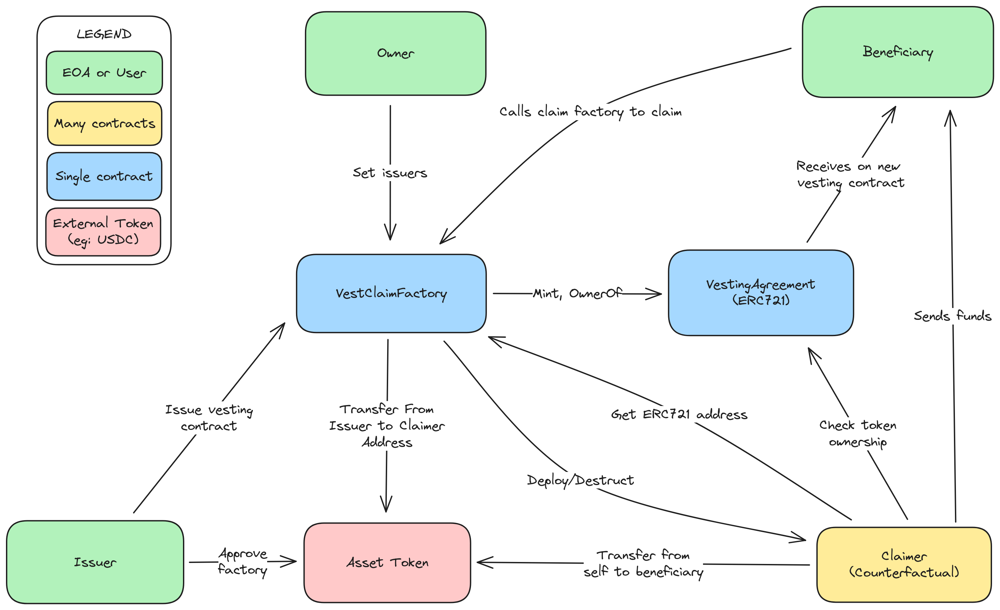

# CounterfactualVesting

> _"Can't steal from a contact with no code!"_

A vesting protocol where funds are stored on counterfactual empty addresses.

## How it works

There are three user types: 

- **Owner**: Owns the `VestClaimFactory` and can assign addresses as an issuer.
- **Issuer**: Can create vesting agreements that will pay out funds to a beneficiary.
- **Beneficiary**: Claims funds from their counterfactual vesting address as time progresses.

There are three contracts:

- **VestClaimFactory**: Main point of interaction for all user types.

    - Owner can set new issuers.
    - Issuers can issue new vesting agreements, sending funds to a counterfactual address.
    - Beneficiaries can claim available vested funds from counterfactual address.

- **VestingAgreement**: An ERC721 token with additional custom logic
    - Each vesting agreement is represented as a unique token.
    - Beneficiaries own these tokens, ownership check is used for claiming.
    - The token ID of each token is the counterfactual address where funds are stored.
    - Each unique token tracks the vesting agreement parameters (amount, start, cliff/vest period).
    - A beneficiary can hold many tokens, each with unique parameters.
    

- **Claimer**: The contract deployed at the counterfactual address.
    - Upon deployment will load the vesting agreement parameters.
    - Calculates how many funds should be sent to benificiary.
    - Once funds are sent the contract will selfdestruct, leaving no code at the address.

### Contract interaction diagram



## What about `SELFDESTRUCT` deprecation?

There are some proposed EIPs that refer to the `SELFDESTRUCT` (SD) opcode. As of 12/17/2023 there are seven EIPs that refer to SD, and of those, four are stagnant. The remaining three are shown below:
- [EIP-6049](https://eips.ethereum.org/EIPS/eip-6049)
- [EIP-6780](https://eips.ethereum.org/EIPS/eip-6780)
- [EIP-6046](https://eips.ethereum.org/EIPS/eip-6046)

The first EIP in the list above is simply a "meta" EIP and will not make any changes to how the EVM handles SD. For the other two, they still allow contracts to created and deleted within the same transaction, meaning this counterfactual approach to vesting still seems viable at this point, however it is not guaranteed.

## Does this support native Ether payments?

Due to the way that the `SELFDESTRUCT` (SD) opcode is described in the [EVM Specification](https://ethereum.github.io/execution-specs/autoapi/ethereum/shanghai/vm/instructions/system/index.html#selfdestruct), it's not possible to send Ether to these counterfactual addresses. The way the `Claimer` contract works is by being deployed, sending unlocked funds and then SD-ing itself. When using SD you specify a recipient for all Ether held on the contract, but we need the Ether to stay in the same address for claiming later as more funds become available. Due to the way the SD opcode is specified, it sets the balance of the new recipient address and then sets the to-be-deleted contract's balance to zero. In other words it transfers to itself, and then deletes its balance.

Since both balance and storage is cleared when using SD, only assets whose ownership can be tracked using storage from a different contract address can be used, hence the support for ERC20 tokens.

## Compilation and testing

```rust
// Install dependencies
forge install

// Compile code
forge build

// Run tests
forge test
```

NOTE: The test suite takes advantage of Foundry's fuzzing capabilities to test a wide variety of inputs when issuing vesting agreements and claiming funds. The amount of runs can be changed in `foundry.toml` under the `fuzz` section, but is currently set to `256` for quick testing.
